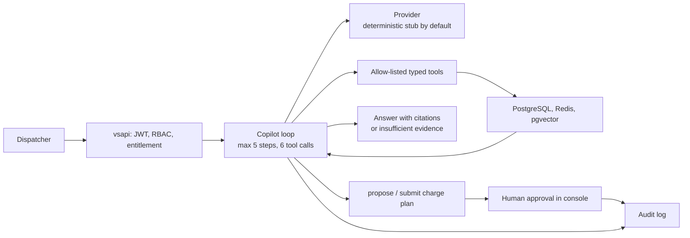

# Charge Ops Copilot: agent architecture

Code: `internal/copilot/` (service, tools, providers). Decision record: [ADR-005](../adr/005-agent-guardrails.md). Scenarios: [`evidence/G10/status.md`](../../evidence/G10/status.md).

## Tools (all exist in `internal/copilot/tools.go`)

| Tool | Effect |
|---|---|
| `list_at_risk_vehicles` | read: vehicles with open range-risk alerts |
| `get_vehicle_state` | read: latest state of one vehicle |
| `get_alert_evidence` | read: stored evidence of an alert |
| `find_reachable_chargers` | read: chargers within reach, straight-line distance (baseline estimate, not road routing) |
| `query_telemetry_summary` | read: summary of recent telemetry |
| `search_similar_incidents` | read: pgvector similarity search; returned text is treated as data, not instructions |
| `propose_charge_plan` | computes a plan; writes nothing |
| `submit_charge_plan` | requests approval; the agent cannot approve; a human approves in the console |

## Guardrails (enforced in code, outside the model)

Tenant comes from the authenticated identity, never from model output; tool allow-list; argument validation; request body 1–1000 chars with unknown fields rejected; 5 steps and 6 tool calls maximum; answers must cite tool results or say "insufficient evidence"; writes are two-phase and human-approved; every step is audited; viewers and tenants without the Copilot plan get 403.

## Providers and limits

A deterministic stub provider is the default and is what all recorded scenarios used. The Anthropic provider activates only when `ANTHROPIC_API_KEY` is set and was **not exercised**; no claim is made about LLM answer quality. Reachability is a straight-line estimate, not a routed ETA.
