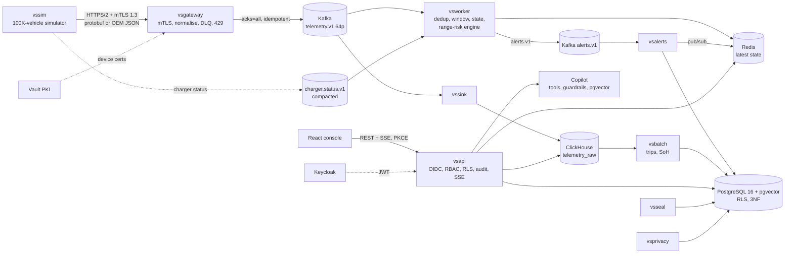

# Architecture

VoltSight answers one question for a 100,000-vehicle EV fleet: **can this vehicle still reach a charger?** — within seconds of the telemetry that makes the answer change — and then schedules charging at the lowest tariff cost. This document describes what is **built and running in this repository**; where the original design differs, the difference is listed under "Deviations".

## Services (one Go module, one image, Kubernetes picks the binary)
| Binary | Role | Owns (writes) |
|---|---|---|
| `vsgateway` | mTLS TLS1.3 ingest; tenant from the client certificate (never the payload); OEM-A/B/schema-v2 normalisation; VIN + DTC validation; DLQ with reason; back-pressure (429 + Retry-After) | `telemetry.v1`, `telemetry.dlq.v1` |
| `vsworker` | exact per-VIN dedup window, Bloom negative cache, Count-Min top-DTC, latest state in Redis; **range-risk engine** (Dijkstra overlay + estimators) | Redis state, `alerts.v1` |
| `vssink` | batch insert to ClickHouse (ReplacingMergeTree on the event identity); retries, commits offsets only after an acked insert | `telemetry_raw` |
| `vsalerts` | idempotent persistence (unique vin+rule+window) + Redis fan-out | `alert` (PostgreSQL) |
| `vsapi` | REST/SSE API, serves the web console; OIDC/JWT, RBAC, subscription entitlements, tenant RLS, rate limit, audit, Copilot | via the app role (RLS) |
| `vsbatch` | trip segmentation, battery SoH from charging sessions, rollup refresh | `trip`, `soh_estimate` |
| `vsseal` | audit hash chain (sealer role: chain columns only) | `audit_log.{seq,prev_hash,hash}` |
| `vsprivacy` | right-to-erasure executor with verification evidence | `driver`, `erasure_request` |
| `vssim` | deterministic physics simulator + delivery client | ground-truth files |

Rule: only the owning service writes a store; each service connects with its own least-privilege PostgreSQL role (`voltsight_app`, `_gateway`, `_alerts`, `_batch`, `_privacy`, `_sealer`).

## Data stores and why
| Store | Holds | Why not the alternatives |
|---|---|---|
| PostgreSQL 16 | tenants, subscriptions, vehicles, drivers, trips, chargers, plans, alerts, users, audit, erasure | ACID + FK integrity + row-level security; strong consistency for approvals/audit |
| pgvector (same PG) | 384-d incident embeddings, HNSW | ≤ ~1M vectors, transactional with tenant metadata; no extra system to run |
| ClickHouse | raw telemetry history | columnar compression, partition pruning, 300K+ rows/s inserts (measured), scans do not touch PostgreSQL (ADR-002) |
| Redis | latest vehicle state, charger status, pub/sub, copilot pending actions | sub-ms KV; rebuildable from Kafka by replay (tested) |
| Kafka | durable ordered log, replay | per-VIN ordering, consumer groups, replay for rebuilds |

## The hot path (what happens to one telemetry sample)
`vssim` → `vsgateway` (mTLS; tenant from cert; validate; normalise) → `telemetry.v1` (key = VIN) → `vsworker`: dedup window → Redis state → **overlay lookup** (O(1): distance to the nearest *available* charger this tenant may use) → decision → `alerts.v1` → `vsalerts` → PostgreSQL + Redis pub/sub → API SSE → browser. Offsets are committed only after state is saved **and** alerts are acknowledged (at-least-once; replays are harmless because every write is seq-guarded or keyed by an idempotency key).

## Consistency and delivery
At-least-once end to end with idempotent sinks ⇒ effectively-once *observable* results (event identity `(vin, seq)`; alert key `(vin, rule, window_start)`; ClickHouse `ReplacingMergeTree`). PostgreSQL data is CP (approvals/audit never lost); telemetry/state are AP and rebuildable. Exactly-once Kafka transactions are not used (ADR-003).

## Deviations from the original plan (honest list)
- The platform API is **Go** (not FastAPI): it reuses the verifier, pgx/RLS helpers and Redis/ClickHouse code of the pipeline. Batch analytics are Go too; Python is used only for the ML training pipeline (`ml/`).
- The Copilot runs **inside** the API process and calls the same data-access functions with the caller's identity (instead of an HTTP hop with token exchange); tenant, permissions and audit apply identically.
- Edge TLS is terminated by the services themselves (`vsapi -tls`, `vsgateway`) / the Kubernetes ingress, not by an Envoy sidecar. MQTT and the Parquet/MinIO cold archive are not built.
- Embeddings use a deterministic hashing embedder (lexical, 384-d) rather than MiniLM; the dimension matches so a semantic model is a drop-in (ADR-005).
- The in-process tree-ensemble evaluator in Go (ADR-007 original plan) was **not** built: the GBM is evaluated offline and its decision-level use is limited to the batch-scored consumption prior; the live estimator is the per-vehicle EWMA.
