# Entity-relationship diagram (generated)

Generated from the migrated PostgreSQL schema by `go run ./cmd/vser`; CI regenerates it and fails on any difference.
Child tables reference their parents with composite `(tenant_id, id)` foreign keys (ADR-006), shown as `tenant_id+...` labels.
See [`docs/3nf.md`](../3nf.md) for the normal-form analysis.

```mermaid
erDiagram
  agent_session ||--o{ agent_action : "tenant_id+session_id"
  app_user |o--o{ agent_action : "tenant_id+approver_id"
  app_user ||--o{ agent_session : "tenant_id+user_id"
  vehicle ||--o{ alert : "tenant_id+vin"
  alert ||--o{ alert_event : "tenant_id+alert_id"
  app_user ||--o{ alert_event : "tenant_id+actor"
  tenant ||--o{ app_user : "tenant_id"
  app_user |o--o{ charge_plan : "tenant_id+approved_by"
  app_user ||--o{ charge_plan : "tenant_id+created_by"
  charge_plan ||--o{ charge_plan_item : "tenant_id+plan_id"
  charger ||--o{ charge_plan_item : "charger_id"
  vehicle ||--o{ charge_plan_item : "tenant_id+vin"
  depot |o--o{ charger : "tenant_id+depot_id"
  tariff_zone ||--o{ charger : "tariff_zone"
  charger ||--o{ charge_session : "charger_id"
  vehicle ||--o{ charge_session : "tenant_id+vin"
  fleet ||--o{ depot : "tenant_id+fleet_id"
  oem ||--o{ device_credential : "oem_code"
  tenant ||--o{ device_credential : "tenant_id"
  tenant ||--o{ driver : "tenant_id"
  app_user ||--o{ erasure_request : "tenant_id+requested_by"
  tenant ||--o{ fleet : "tenant_id"
  tenant ||--o{ incident_embedding : "tenant_id"
  plan ||--o{ plan_feature : "plan_code"
  model_version |o--o{ soh_estimate : "model_version_id"
  vehicle ||--o{ soh_estimate : "tenant_id+vin"
  plan ||--o{ subscription : "plan_code"
  tenant ||--o{ subscription : "tenant_id"
  tariff_zone ||--o{ tariff_band : "zone_id"
  vehicle ||--o{ trip : "tenant_id+vin"
  app_user ||--o{ user_role : "tenant_id+user_id"
  role ||--o{ user_role : "role_code"
  depot |o--o{ vehicle : "tenant_id+home_depot_id"
  fleet ||--o{ vehicle : "tenant_id+fleet_id"
  vehicle_model ||--o{ vehicle : "model_id"
  driver ||--o{ vehicle_driver_assignment : "tenant_id+driver_id"
  vehicle ||--o{ vehicle_driver_assignment : "tenant_id+vin"
  oem ||--o{ vehicle_model : "oem_code"
  agent_action {
    uuid id PK
    uuid tenant_id FK
    uuid session_id FK
    text tool
    character args_hash
    text status
    uuid approver_id FK
    character result_hash
    timestamptz created_at
  }
  agent_session {
    uuid id PK
    uuid tenant_id FK
    uuid user_id FK
    text llm
    timestamptz created_at
  }
  alert {
    uuid id PK
    uuid tenant_id FK
    character vin FK
    text rule
    text severity
    timestamptz window_start
    text status
    timestamptz detected_at
    timestamptz source_event_ts
    timestamptz source_recv_ts
    jsonb evidence
    timestamptz created_at
  }
  alert_event {
    bigint id PK
    uuid tenant_id FK
    uuid alert_id FK
    uuid actor FK
    text action
    timestamptz at
  }
  app_user {
    uuid id PK
    uuid tenant_id FK
    text email
    text display_name
    boolean active
    timestamptz created_at
  }
  audit_log {
    bigint id PK
    timestamptz ts PK
    uuid tenant_id
    text actor
    text actor_type
    text action
    text resource_type
    text resource_id
    uuid subject_id
    text request_id
    jsonb details
    bigint seq
    bytea prev_hash
    bytea hash
  }
  charge_plan {
    uuid id PK
    uuid tenant_id FK
    text status
    uuid created_by FK
    uuid approved_by FK
    timestamptz created_at
    timestamptz approved_at
    numeric cost_estimate
    numeric baseline_cost_estimate
  }
  charge_plan_item {
    uuid tenant_id FK
    uuid plan_id PK,FK
    character vin PK,FK
    uuid charger_id FK
    timestamptz start_at PK
    timestamptz end_at
    numeric target_soc
  }
  charge_session {
    bigint id PK
    uuid tenant_id FK
    character vin FK
    uuid charger_id FK
    timestamptz started_at
    timestamptz ended_at
    numeric soc_start
    numeric soc_end
    numeric kwh
  }
  charger {
    uuid id PK
    uuid tenant_id FK
    uuid depot_id FK
    text name
    float8 lat
    float8 lon
    text geohash
    numeric power_kw
    smallint tariff_zone FK
  }
  depot {
    uuid id PK
    uuid tenant_id FK
    uuid fleet_id FK
    text name
    text city
    float8 lat
    float8 lon
  }
  device_credential {
    uuid id PK
    uuid tenant_id FK
    text oem_code FK
    text cert_serial UK
    character cert_fingerprint UK
    text status
    timestamptz not_before
    timestamptz not_after
    timestamptz created_at
    timestamptz revoked_at
  }
  driver {
    uuid id PK
    uuid tenant_id FK
    text pseudonym
    bytea pii_enc
    timestamptz created_at
    timestamptz erased_at
  }
  erasure_request {
    uuid id PK
    uuid tenant_id FK
    uuid subject_id
    uuid requested_by FK
    text status
    timestamptz requested_at
    timestamptz completed_at
    jsonb verification
  }
  fleet {
    uuid id PK
    uuid tenant_id FK
    text name
    timestamptz created_at
  }
  incident_embedding {
    uuid id PK
    uuid tenant_id FK
    text kind
    text source_ref
    text body
    vector embedding
    jsonb meta
    timestamptz created_at
  }
  model_version {
    uuid id PK
    text name
    text version
    text artefact_uri
    character sha256
    jsonb metrics
    timestamptz created_at
  }
  oem {
    text code PK
    text dialect
  }
  plan {
    text code PK
  }
  plan_feature {
    text plan_code PK,FK
    text feature PK
  }
  role {
    text code PK
  }
  soh_estimate {
    uuid tenant_id FK
    character vin PK,FK
    timestamptz as_of PK
    text method PK
    numeric capacity_kwh
    uuid model_version_id FK
  }
  subscription {
    uuid id PK
    uuid tenant_id FK
    text plan_code FK
    timestamptz valid_from
    timestamptz valid_to
  }
  tariff_band {
    smallint zone_id PK,FK
    smallint hour_from PK
    smallint hour_to
    numeric price_per_kwh
  }
  tariff_zone {
    smallint id PK
    text name UK
    character currency
  }
  tenant {
    uuid id PK
    text name UK
    text region
    timestamptz created_at
  }
  trip {
    bigint id PK
    uuid tenant_id FK
    character vin FK
    timestamptz started_at
    timestamptz ended_at
    text start_geohash
    text end_geohash
    numeric distance_km
    numeric energy_kwh
  }
  user_role {
    uuid tenant_id FK
    uuid user_id PK,FK
    text role_code PK,FK
  }
  vehicle {
    character vin PK
    uuid tenant_id FK
    uuid fleet_id FK
    smallint model_id FK
    uuid home_depot_id FK
    date commissioned_at
  }
  vehicle_driver_assignment {
    bigint id PK
    uuid tenant_id FK
    character vin FK
    uuid driver_id FK
    timestamptz valid_from
    timestamptz valid_to
  }
  vehicle_model {
    smallint id PK
    text oem_code FK
    text name
    numeric battery_kwh_nominal
    numeric kwh_per_100km_wltp
    numeric max_dc_kw
  }
```

