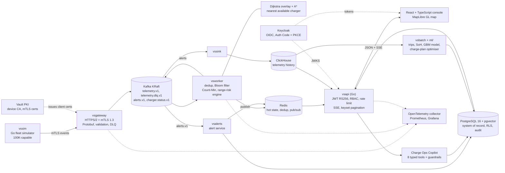
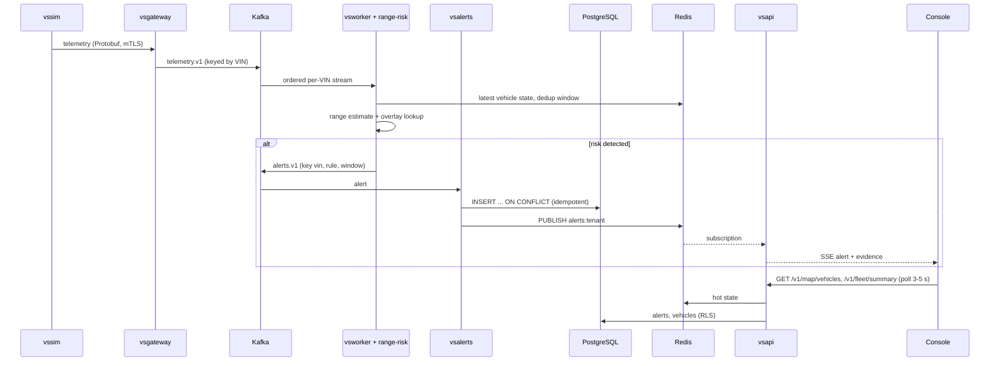
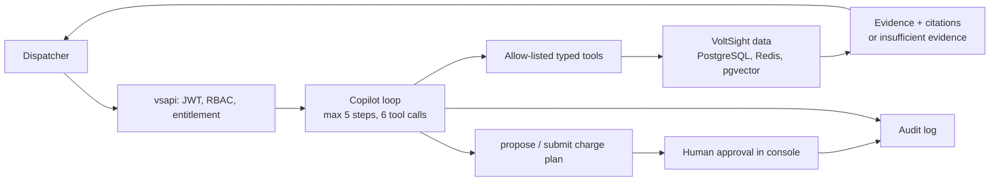

# VoltSight — EV Fleet Range-Risk & Charge Orchestration

VoltSight tells every EV in a 100,000-vehicle connected fleet whether it can still reach a charger, within seconds of the telemetry that changes the answer, and plans charging at the lowest time-of-use cost. **All data is synthetic.**

> Every capability below is backed by a committed test or measurement under [`evidence/`](evidence/). Anything not verified is listed in [Known limitations](#17-known-limitations) and in the machine-checked [Final Requirement Matrix](docs/compliance/FINAL_REQUIREMENT_MATRIX.md). Measurements were taken on a 4-vCPU Linux sandbox with every component on one host unless stated.

**Contents:** [1 Problem](#1-problem) · [2 Solution](#2-solution) · [3 Capabilities](#3-key-capabilities) · [4 Architecture](#4-system-architecture) · [5 Data flow](#5-real-time-data-flow) · [6 Data stores](#6-data-stores) · [7 Security](#7-security) · [8 Agentic AI](#8-agentic-ai-charge-ops-copilot) · [9 ML](#9-machine-learning) · [10 Performance](#10-performance--scale) · [11 Observability](#11-observability) · [12 Deployment](#12-deployment) · [13 Quick start](#13-quick-start) · [14 Demo](#14-demo) · [15 Testing](#15-testing) · [16 Docs](#16-documentation-index) · [17 Limitations](#17-known-limitations) · [18 Stack](#18-technology-stack) · [19 License and disclosure](#19-license-data-and-disclosure)

## 1. Problem

Fleet operators cannot see which vehicles will strand before they do:

- **Range uncertainty.** Nominal range is not usable range; real consumption varies by vehicle, route and driver.
- **Battery degradation.** State of health reduces capacity, and it is not reported directly.
- **Temperature, load and route effects** change energy per km hour by hour.
- **Charger availability.** The nearest charger may be faulted or occupied.
- **Charging cost.** Time-of-use tariffs make *when* to charge a large cost lever.
- **Real-time risk.** The answer is only useful if it arrives while the driver can still act.

## 2. Solution

VoltSight ingests vehicle telemetry over mutually authenticated TLS, evaluates each vehicle's range risk against the nearest *available* charger, raises deduplicated alerts with evidence, and gives dispatchers a live console and an audited, approval-gated assistant.

- **Live telemetry** from a deterministic simulator (physics, trips, charging, faults, duplicates, out-of-order and malformed data).
- **Range-risk computation** per event: EWMA range estimate, SoC, distance to the nearest available charger from a multi-source Dijkstra overlay, hysteresis.
- **Charger reachability** with an A* route drawn on the map from the alert's own evidence.
- **Automated alerts** persisted idempotently and pushed to the browser (SSE).
- **Charge orchestration**: time-of-use optimiser (dynamic programming) with human-approved plans.
- **Fleet analytics** in ClickHouse: trips, state of health, history queries.
- **ML**: gradient-boosted energy-consumption model against three baselines.
- **Charge Ops Copilot**: typed tools, guardrails outside the model, citations, approval-gated writes.
- **Security and tenant isolation**: OIDC + PKCE, RBAC, PostgreSQL row-level security, audit hash chain, location masking.

## 3. Key capabilities

All items exist in the repository; evidence for each is in the [matrix](docs/compliance/FINAL_REQUIREMENT_MATRIX.md).

- Real-time telemetry pipeline (gateway → Kafka → worker → ClickHouse / Redis / PostgreSQL)
- Range-risk engine with incremental overlay updates when a charger fails
- Charger reachability and A* route evidence
- Automated alerts with idempotent persistence and live push
- Live geographic fleet map (MapLibre GL, clustering, city filters, vehicle/charger/alert panels)
- Battery state-of-health and trip analytics (batch)
- Time-of-use charge scheduling (DP optimiser)
- Vector-powered incident retrieval (pgvector)
- Agentic Charge Ops Copilot (8 typed tools, two-phase human-approved writes)
- RBAC, subscription entitlements, tenant isolation (RLS), GDPR/DPDP-style erasure workflow
- Audit trail with a hash chain; role-based location masking
- Observability: Prometheus metrics, OpenTelemetry collector, Grafana, structured logs

## 4. System architecture

Components shown are the ones in the repository and the Compose stack. Not implemented (and therefore not drawn): a cold Parquet/object-store archive, Loki, Tempo, a cloud-hosted production deployment.



## 5. Real-time data flow



Delivery is at-least-once with idempotent sinks (alert key `(vin, rule, window_start)`, ClickHouse `ReplacingMergeTree`), so results are effectively-once ([ADR-003](docs/adr/003-consistency-delivery.md)).

## 6. Data stores

| Store | Purpose | Why | Status |
|---|---|---|---|
| PostgreSQL 16 | System of record: tenants, vehicles, alerts, plans, audit, subscriptions | Relational integrity, RLS, ACID approvals | Implemented |
| pgvector (in PostgreSQL) | Incident/alert embeddings for similar-incident search | Semantic retrieval without another service | Implemented |
| Redis | Latest vehicle state, dedup window, alert pub/sub, caches | Low-latency operational access | Implemented |
| Kafka (KRaft) | Durable event log, replay, decoupling | 64 partitions keyed by VIN | Implemented |
| ClickHouse | Telemetry history and analytics | 4.2× PostgreSQL insert rate on 1M rows (405K vs 97K rows/s) | Implemented |
| Vault (dev mode) | Device PKI | Short-lived mTLS certificates | Implemented (dev mode, in-memory) |
| Object store / Parquet cold archive | Cold tier, training data | — | **Not implemented** |

Justification and measurements: [ADR-002](docs/adr/002-polyglot-storage.md), [3NF design](docs/3nf.md), [ER diagram](docs/er/README.md).

## 7. Security

| Control | Implementation |
|---|---|
| Identity | Keycloak OIDC, Authorization Code + PKCE (no password grant for the web client) |
| Tokens | JWT RS256 validated against JWKS; 300 s access tokens renewed by refresh-token grant ([ADR-009](docs/adr/009-session-and-token-lifecycle.md)) |
| Authorization | RBAC (viewer, dispatcher, energy manager, tenant admin) + subscription entitlements |
| Tenant isolation | Tenant from token claim; PostgreSQL RLS (enabled and forced) with composite tenant FKs; cross-tenant reads return 404 |
| Transport | Device ingest: HTTPS/2 + mutual TLS 1.3, tenant from the client certificate (Vault PKI). Browser: TLS at the edge proxy |
| Audit | Append-only `audit_log` with request id and a verifiable hash chain |
| Input validation | VIN check digit, DTC, schema validation, per-event DLQ, request size and rate limits, strict JSON for Copilot |
| Secrets | Generated per deployment into a git-ignored `.env`; gitleaks clean; nothing committed |
| Privacy | Role-based location masking; erasure workflow |
| Edge | CSP, HSTS, `X-Frame-Options: DENY`; Keycloak admin, master realm and metrics blocked at the proxy |

OWASP ZAP baseline (unauthenticated): **58 checks passed, 0 failures, 3 warning groups** (documented, not hidden). Details: [`docs/security/SECURITY_SUMMARY.md`](docs/security/SECURITY_SUMMARY.md), [`docs/security/STRIDE.md`](docs/security/STRIDE.md), [`docs/owasp-map.md`](docs/owasp-map.md).

## 8. Agentic AI: Charge Ops Copilot

The Copilot is a bounded tool-using agent. Policy is enforced by code outside the model: tenant comes from the authenticated identity, tools are an allow-list, arguments are validated, steps are capped (5 steps, 6 tool calls), and the agent can only *propose* a write; a human approves it in the console.



Tools (all in `internal/copilot/tools.go`): `list_at_risk_vehicles`, `get_vehicle_state`, `get_alert_evidence`, `find_reachable_chargers` (straight-line, baseline estimate), `query_telemetry_summary`, `search_similar_incidents` (returned text is treated as data, not instructions), `propose_charge_plan`, `submit_charge_plan` (requests approval only). Default provider is a deterministic stub; the Anthropic provider activates only when `ANTHROPIC_API_KEY` is set and was **not exercised**. See [`docs/agent/AGENT_ARCHITECTURE.md`](docs/agent/AGENT_ARCHITECTURE.md) and [ADR-005](docs/adr/005-agent-guardrails.md).

## 9. Machine learning

| Item | Value |
|---|---|
| Target | Energy consumption per trip, kWh/km |
| Baselines | Fleet mean, model catalogue, per-vehicle history (best) |
| Model | `HistGradientBoostingRegressor`, artifact SHA-256 recorded |
| Data | 2,500 simulated vehicles, 24,006 trips (simulator physics; no real vehicles) |
| Split | A: 500 held-out *vehicles* (4,755 trips). B: time hold-out (4,813 trips) |
| Leakage checks | Vehicle sets disjoint; features exclude the label; first-trip prior equals catalogue; shuffled-label model is worse (MAE 0.0515) |
| Result A | GBM MAE 0.01736 / MAPE 7.2% vs best baseline 0.0274 / 11.5%; 95% CI of the difference −0.0112…−0.0088 |
| Result B | GBM MAE 0.01718 / MAPE 6.6% vs 0.02489 / 9.9% |
| Limitation | Labels come from the simulator; absolute errors do not transfer to real fleets |

Source: [`evidence/G8/ml_report.json`](evidence/G8/ml_report.json); write-up: [`docs/ml/ML_RESULTS.md`](docs/ml/ML_RESULTS.md).

## 10. Performance & scale

Targets are not results. Status uses the [Final Requirement Matrix](docs/compliance/FINAL_REQUIREMENT_MATRIX.md) definitions.

| Target | Actual evidence | Status |
|---|---|---|
| 100K vehicles | 100,000 vehicles streamed in real time through the mTLS gateway ([G4](evidence/G4/status.md)) | PASS |
| 100K events/s | 98.3K events/s for 60 s (6.0M events, 0 failed, books reconcile) | PARTIAL (short of 100K, 60 s only) |
| 3× burst for 5 min | 3× burst for 40 s inside a 100 s run: 18.0M events, 0 lost ([G14](evidence/G14/status.md)) | PARTIAL (40 s, not 5 min) |
| Critical alert < 5 s | At 100K ev/s receive→persist p50 9.8 s, p99 17.0 s; at demo scale receive→detect p50 28 ms, p95 133 ms (n=33) | **FAIL at 100K ev/s** on one host |
| API p95 < 200 ms | p95 26.8 ms, 829 req/s, 100K-vehicle database, ingest idle ([G9b](evidence/G9b/api_latency.json)) | PASS |
| API p99 < 500 ms | p99 41.0 ms (same run) | PASS |
| Soak | Not run | NOT VERIFIED |
| Horizontal scale-out | Not run (design only) | NOT VERIFIED |

Details, storage calculations and the measured/calculated/design-target split: [`docs/performance/CAPACITY_ANALYSIS.md`](docs/performance/CAPACITY_ANALYSIS.md).

## 11. Observability

- **Structured logs:** Go `slog` in every service; API errors carry `request_id` (also stored in `audit_log.request_id`).
- **Metrics:** Prometheus `/metrics` on the gateway and worker (events accepted/rejected, verdict counters); Keycloak metrics; scraped every 5 s.
- **Traces:** an OpenTelemetry collector is deployed and scraped; distributed tracing across services is **not** fully instrumented and there is no Tempo/Loki backend.
- **Kafka lag, throughput:** measured by the reconciliation tool `vsrecon` and recorded in the load evidence.
- **Alert latency:** `recv_to_persist_ms` / `recv_to_decision_ms` logged per alert by the alert service.
- **Service health:** `/healthz`, `/readyz` per service; Compose health checks gate startup.
- **Dashboards:** Grafana provisioned with the Prometheus datasource.

## 12. Deployment

| Target | What exists | Verified |
|---|---|---|
| Local | Docker Compose, `make up` (`deploy/compose/`) | Yes |
| Live demo | `deploy/live/up.sh`: whole platform behind one HTTPS origin, run in **GitHub Codespaces** | Yes, as a demo environment |
| Kubernetes | Helm chart `deploy/helm/voltsight` | lint + kubeconform; accepted by an ephemeral kind API server in CI; no pod-level run with all backing services |
| IaC | Terraform AWS and GCP (`deploy/terraform`) | `validate` only; **never applied** |
| CI/CD | GitHub Actions: build, unit tests, web tests, Helm, Terraform validate, scans, traceability gate, image published to GHCR | Yes |

**Live demo ≠ production.** The Codespaces deployment is a single 4-core host that runs ~2,000 simulated vehicles for demonstration. The production deployment target (Kubernetes/cloud, multi-node Kafka, managed stores, non-dev Vault) is described and validated as code but was not deployed. Free-tier research: [`docs/deployment-live.md`](docs/deployment-live.md).

Live demo (while the owner's Codespace is running; it sleeps when idle and is not guaranteed): `https://special-acorn-jj4x7q5rx5jxfqj67-8080.app.github.dev`. Sign-in credentials are generated per deployment and printed by `up.sh`; they are not published.

## 13. Quick start

Prerequisites: Docker (≥ 12 GB RAM) with Compose v2, Go ≥ 1.27, Node 22, `make`, Python ≥ 3.11 (ML only).

```bash
git clone https://github.com/SohamB4746Y/voltsight-connected-vehicle-intelligence.git
cd voltsight-connected-vehicle-intelligence

# Option A, whole platform behind one origin with a 2,000-vehicle simulator (prints URL and logins)
deploy/live/up.sh                         # console: http://localhost:8080
deploy/live/up.sh --reset-demo            # clean demo start

# Option B, developer workflow
make up                                   # generates .env credentials, starts stack, migrates, roles, device CA, topics
                                          # restricted sandbox: make up-lowulimit
make seed                                 # deterministic 100,000-vehicle dataset (verified against db/seed/manifest.json)
make demo                                 # builds binaries + console, starts the pipeline and a 100K-vehicle simulation
                                          # console: http://localhost:8081 ; API: http://localhost:8080 (see docs/demo.md)

make test                                 # unit tests, no Docker
make test-integration                     # real Kafka/PostgreSQL/ClickHouse/Redis/Keycloak/Vault
docker compose -f deploy/compose/docker-compose.yml -f deploy/compose/docker-compose.live.yml --env-file .env down   # shutdown (Option A)
```

Demo users: `viewer|dispatcher|energy_manager|tenant_admin@meridian.example` (enterprise plan, Copilot enabled) and the same roles `@coastal.example` (pro plan, no Copilot). The password is `DEMO_USER_PASSWORD` in the git-ignored `.env`. Nothing secret is committed.

## 14. Demo

Full script with timings: [`docs/demo/5_MINUTE_DEMO_SCRIPT.md`](docs/demo/5_MINUTE_DEMO_SCRIPT.md).

1. **Login** as `dispatcher@meridian.example` (Keycloak, PKCE).
2. **Dashboard:** fleet summary and live feed refresh every 3–5 s.
3. **Observe live vehicles** on the **map**: clustered markers, city buttons, chargers.
4. **Select a vehicle:** state of charge, estimated range, status.
5. **Show range-risk:** at-risk vehicles are coloured; the panel shows margin and nearest charger.
6. **Alert:** automated alerts arrive on their own; open one to see its **evidence** (SoC, margin, charger, route line on the map).
7. **Charger reachability:** the route from the alert evidence is drawn on the map.
8. **Copilot** (enterprise tenant): ask “Which vehicles are at risk of not reaching a charger?”; answers cite tool results; plans need human approval.
9. **Security:** sign in as `dispatcher@coastal.example` and confirm a Meridian vehicle returns 404; as `viewer` the audit log and Copilot return 403.

## 15. Testing

| Category | Status | Evidence |
|---|---|---|
| Unit | Run | Go unit tests gated at ≥ 80% coverage on the gated packages (vin 100%, jwtverify 93%; [G1](evidence/G1/status.md)); 14 web tests ([`web/src/auth.test.ts`](web/src/auth.test.ts)) |
| Integration | Run (real Kafka/PG/CH/Redis/Keycloak/Vault) | `go test -tags stack`, [G1](evidence/G1/status.md) |
| E2E | Run at 100K vehicles; browser journey and 31 scripted live checks as real users | [G4](evidence/G4/status.md), [`live_checks.json`](evidence/live-deployment/live_checks.json) |
| Security | gitleaks, govulncheck, npm audit, semgrep, Trivy, TLS checks, SBOM | [G12](evidence/G12/status.md) |
| DAST | ZAP baseline, unauthenticated: 58 pass, 0 fail, 3 warning groups | [`evidence/security/zap/`](evidence/security/zap/) |
| Chaos / restart | 5 scenarios, 0 events lost; full-stack restart recovery | [`docs/testing/CHAOS_RESULTS.md`](docs/testing/CHAOS_RESULTS.md) |
| Contract | Protobuf `buf` lint/breaking tests; **no Pact** | [G1](evidence/G1/status.md) |
| BDD | **Not implemented** | — |
| Load | 100K vehicles for 60 s, 3× burst for 40 s | [G4](evidence/G4/status.md), [G14](evidence/G14/status.md) |
| Soak | **Not run** | — |

Summary: [`docs/testing/TESTING_SUMMARY.md`](docs/testing/TESTING_SUMMARY.md).

## 16. Documentation index

| Document | Path |
|---|---|
| Solution Document | [`docs/solution/SOLUTION_DOCUMENT.md`](docs/solution/SOLUTION_DOCUMENT.md) |
| Final Requirement Matrix | [`docs/compliance/FINAL_REQUIREMENT_MATRIX.md`](docs/compliance/FINAL_REQUIREMENT_MATRIX.md) |
| Final Submission Status | [`docs/compliance/FINAL_SUBMISSION_STATUS.md`](docs/compliance/FINAL_SUBMISSION_STATUS.md) |
| Code Freeze | [`docs/compliance/CODE_FREEZE.md`](docs/compliance/CODE_FREEZE.md) |
| Architecture | [`docs/architecture.md`](docs/architecture.md) · [ADRs](docs/adr/) |
| Security summary | [`docs/security/SECURITY_SUMMARY.md`](docs/security/SECURITY_SUMMARY.md) |
| STRIDE threat model | [`docs/security/STRIDE.md`](docs/security/STRIDE.md) |
| CAP / PACELC | [`docs/architecture/CAP_PACELC.md`](docs/architecture/CAP_PACELC.md) |
| SQL optimization | [`docs/database/SQL_OPTIMIZATION.md`](docs/database/SQL_OPTIMIZATION.md) |
| ML results | [`docs/ml/ML_RESULTS.md`](docs/ml/ML_RESULTS.md) |
| Agent architecture | [`docs/agent/AGENT_ARCHITECTURE.md`](docs/agent/AGENT_ARCHITECTURE.md) |
| Testing summary | [`docs/testing/TESTING_SUMMARY.md`](docs/testing/TESTING_SUMMARY.md) |
| Chaos results | [`docs/testing/CHAOS_RESULTS.md`](docs/testing/CHAOS_RESULTS.md) |
| Capacity analysis | [`docs/performance/CAPACITY_ANALYSIS.md`](docs/performance/CAPACITY_ANALYSIS.md) |
| Demo script | [`docs/demo/5_MINUTE_DEMO_SCRIPT.md`](docs/demo/5_MINUTE_DEMO_SCRIPT.md) |
| AI / OSS disclosure | [`docs/AI_OSS_DISCLOSURE.md`](docs/AI_OSS_DISCLOSURE.md) |
| Submission package (Solution Document PDF, explainer video, manifest, QA and honesty reports) | [`submission/`](submission/SUBMISSION_MANIFEST.md) |
| Demo script with voice-over | [`docs/submission/DEMO_SCRIPT.md`](docs/submission/DEMO_SCRIPT.md) |
| Live deployment | [`docs/deployment-live.md`](docs/deployment-live.md) |

## 17. Known limitations

Source of truth: the [Final Requirement Matrix](docs/compliance/FINAL_REQUIREMENT_MATRIX.md) and [Final Submission Status](docs/compliance/FINAL_SUBMISSION_STATUS.md).

- **Critical-alert latency target (< 5 s) is not met at 100K events/s** on one 4-vCPU host (p50 9.8 s, p99 17.0 s receive→persist); multi-host sizing was not tested.
- 100K events/s was reached as 98.3K for 60 s; the 3× burst ran 40 s, not 5 min; no soak and no scale-out run.
- Real OpenFreeMap basemap was not seen rendering in the sandbox browser (certificate interception); the markers-only fallback was verified. Check it in a normal browser.
- No BDD suite and no Pact consumer-driven contracts; ZAP is an unauthenticated baseline that predates the CSP tightening.
- No cold Parquet/object-store tier; no Loki/Tempo; end-to-end tracing is partial.
- Production cloud deployment was not performed: Terraform is validated, never applied; Vault runs in dev mode.
- Live demo runs in GitHub Codespaces and may be stopped; the `v1.0-submission` tag exists only locally (push refused with HTTP 403).
- ML labels are simulated; the Anthropic LLM provider needs the owner's API key and was not exercised (default is a deterministic stub).
- Accessibility scan, billion-row batch run and demo video not done; the Solution Document template was not provided (a structured substitute is supplied).

## 18. Technology stack

| Layer | Technology |
|---|---|
| Services | Go (gateway, worker, sink, alert service, API, simulator, batch), Protobuf contracts (`buf`) |
| Streaming | Kafka (KRaft), franz-go client |
| Data | PostgreSQL 16 + pgvector, Redis, ClickHouse |
| Identity and PKI | Keycloak (OIDC), HashiCorp Vault (dev mode) |
| Web | React, TypeScript, Vite, MapLibre GL JS 6.11.2, vitest |
| ML | Python, scikit-learn `HistGradientBoostingRegressor` |
| Observability | Prometheus, Grafana, OpenTelemetry collector |
| Delivery | Docker, Docker Compose, Caddy, Helm, Terraform (AWS, GCP), GitHub Actions, GHCR |

## 19. License, data and disclosure

- **Data:** entirely synthetic (own simulator and seed generator); no real vehicle or personal data.
- **AI / OSS disclosure:** [`docs/AI_OSS_DISCLOSURE.md`](docs/AI_OSS_DISCLOSURE.md) lists AI assistance and open-source dependencies.
- **Third-party dependencies:** open-source, listed in `go.mod` and `web/package-lock.json`; an image SBOM (CycloneDX) is at [`evidence/security/sbom-image.cdx.json`](evidence/security/sbom-image.cdx.json).
- **Map attribution:** basemap © OpenFreeMap, © OpenMapTiles, data © OpenStreetMap contributors; rendered with MapLibre GL JS (BSD-3-Clause). No API keys.
- **Motorq:** named only as an industry reference in the problem statement; this project has no affiliation with Motorq.
